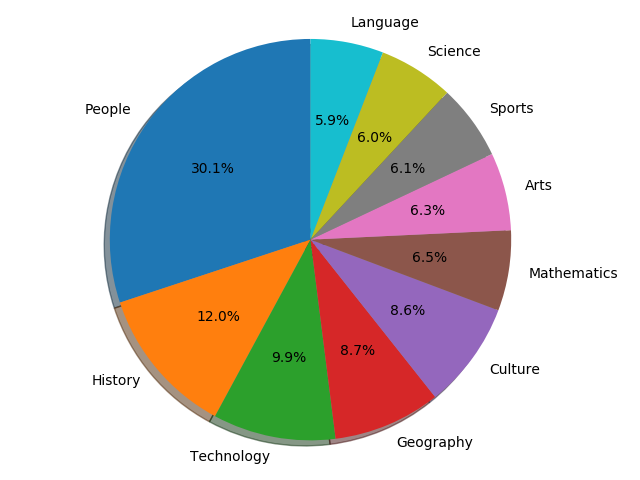
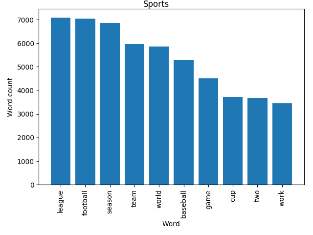
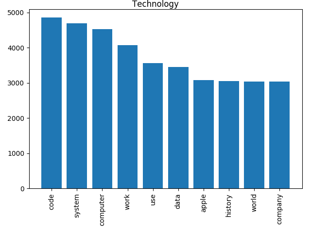

# Wikipedia-Heavy-Hitters
This repository contains the code solving the problem of finding the most common words used in the 25 top-level categories.

## Installation
Installation guide

### Python
    pip install -r requirements.txt

Open a python shell and type:

    import nltk
    nltk.download('stopwords')
    
You should now be able to run main.py

## Usage

## Results
A showcase of our results after parsing 8600 articles. The results can be generated using the stats.py, it uses the log of the main.py to generate the results. Only use the last block of the output (See or use logs.txt as an example).

### Distribution
Showing the distribution of articles being assigned to the 10 largest macro-categories.

### Heavy-hitters
The 10 largest heavy-hitters for "Sports" and "Technology" respectively:

### Unique heavy-hitters:
For Sports:
    
    {'cup', 'football', 'season', 'league', 'baseball', 'team'}

For Technology:
    
    {'computer', 'system', 'company', 'apple', 'data'}
